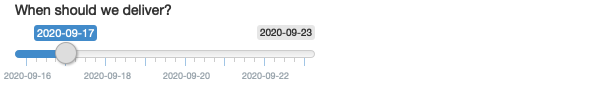

```{r setup, include=FALSE}
knitr::opts_chunk$set(echo = TRUE)
library(shiny)
library(tidyverse)
```

## Inputs

Inputs can be text, numbers, and dates, and the options can range from dropdowns, to radio buttons, to checkboxes, to file uploads and more.

### Practice

**1. When space is at a premium, it's useful to label text boxes using a placeholder that appears inside the text entry area. How do you call `textInput()` to generate the UI below?**


```{r input1, eval=FALSE}
textInput("name", "", placeholder = "Your name")
```

**2. Carefully read the documentation for `sliderInput()` to figure out how to create a date slide, as shown below.**



```{r input2, eval=FALSE}
sliderInput("delivery", "When should we deliver", 
                min = as.Date("2020-09-16"), 
                max = as.Date("2020-09-23"), 
                value = as.Date("2020-09-17"), 
                timeFormat = "%F")

```

**3. If you have a moderately long list, it’s useful to create sub-headings that break the list up into pieces. Read the documentation for `selectInput()` to figure out how. (Hint: the underlying HTML is called `<optgroup>`.)**

In `selectInput()`, it's possible to group related inputs by providing a named list whose elements are (either named or unnamed) lists, vectors, or factors to the `choices` argument. In this case, the outermost names will be used as the group labels (leveraging the `<optgroup>` HTML tag) for the elements in the respective sublist. 

For example:

```{r input3, eval=FALSE}
selectInput("state", "Choose a state:",
      list(`East Coast` = list("NY", "NJ", "CT"),
           `West Coast` = list("WA", "OR", "CA"),
           `Midwest` = list("MN", "WI", "IA"))
)
```

**4. Create a slider input to select values between 0 and 100 where the interval between each selectable value on the slider is 5. Then, add animation to the input widget so when the user presses play the input widget scrolls through automatically.**

```{r input4, eval=FALSE}
sliderInput("values", 
            "Select values:", 
            min = 0, 
            max = 100, 
            value = 30, 
            step = 5,
            animate = TRUE)
```

**5. Using the following numeric input box the user can enter any value between 0 and 1000. What is the purpose of the step argument in this widget?**

```{r input5, eval=FALSE}
numericInput("number", "Select a value", value = 150, min = 0, max = 1000, step = 50)
```

The step argument specifies that the interval between each selectable value is 50. That is, users must select a value between 0 - 1000 that is an interval of 50. 

## Outputs

Outputs create placeholders that are filled by the values in the server function. 

Each output function on the front end is coupled with a render function in the back end. 

There are three main types of render functions: text, tables, and plots. 

### Practice

**1. Re-create the Shiny app from the plots section, this time setting height to 300px and width to 700px.**

```{r output1, eval=FALSE}
ui <- fluidPage(
    plotOutput("plot", width = "700px", height = "300px")
)

server <- function(input, output, session) {
    output$plot <- renderPlot(plot(1:5), res = 96)
}
```

**2. Add an additional plot to the right of the existing plot, and size it so that each plot takes up half the width of the app.**

```{r output2, eval=FALSE}
ui <- fluidPage(
  fluidRow(
    plotOutput("plot1", width = "50%"),
    plotOutput("plot2", width = "50%"))
)

server <- function(input, output, session) {
    output$plot1 <- renderPlot(plot(1:5), res = 96)
    output$plot2 <- renderPlot(plot(1:5), res = 96)
}
```

**3. Update the options for `renderDataTable()` below so that the table is displayed, but nothing else, i.e. remove the search, ordering, and filtering commands. You’ll need to read `?renderDataTable` and review the options at https://datatables.net/reference/option/.**

```{r output3_original, eval=FALSE}
ui <- fluidPage(
  dataTableOutput("table")
)
server <- function(input, output, session) {
  output$table <- renderDataTable(mtcars, options = list(pageLength = 5))
}
```

When working with `renderDataTable()` you can provide a list of initialization options for your data table to the `options` argument. For example:

```{r output3_fixed, eval=FALSE}
ui <- fluidPage(
    dataTableOutput("table")
)
server <- function(input, output, session) {
    output$table <- renderDataTable(mtcars, options = list(pageLength = 5,
                                                           ordering = FALSE,
                                                           searching = FALSE))
```

## Layouts

The `fluidPage()` function uses a **bootstrap** layout system and sets up the HTML, CS, and JS that Shiny needs. 

Create rows using `fluidRow()` and put columns in those rows using `column()`. 

### Practice 

**1. Modify the Central Limit Theorem app so that the sidebar is on the right instead of the left.**

Set the `position` argument to `sidebarLayout` as "right": 

```{r layout1}
ui <- fluidPage(
  titlePanel("Central limit theorem"),
  sidebarLayout(
    sidebarPanel(
      numericInput("m", "Number of samples:", 2, min = 1, max = 100)
    ),
    mainPanel(
      plotOutput("hist")
    ),
    position = "right"
  )
)

server <- function(input, output, session) {
  output$hist <- renderPlot({
    means <- replicate(1e4, mean(runif(input$m)))
    hist(means, breaks = 20)
  }, res = 96)
}
```

**2. Browse the themes available in the `shinythemes` package, pick an attractive theme, and apply it the Central Limit Theorem app.**

Let's go with "yeti":

```{r layout2, eval=FALSE}
ui <- fluidPage(theme = shinytheme("yeti"),
    titlePanel("Central limit theorem"),
    sidebarLayout(
        sidebarPanel(
            numericInput("m", "Number of samples:", 2, min = 1, max = 100)
        ),
        mainPanel(
            plotOutput("hist")
        ),
        position = "right"
    )
)

server <- function(input, output, session) {
    output$hist <- renderPlot({
        means <- replicate(1e4, mean(runif(input$m)))
        hist(means, breaks = 20)
    }, res = 96)
}
```
