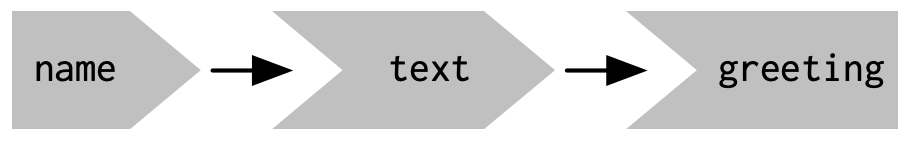
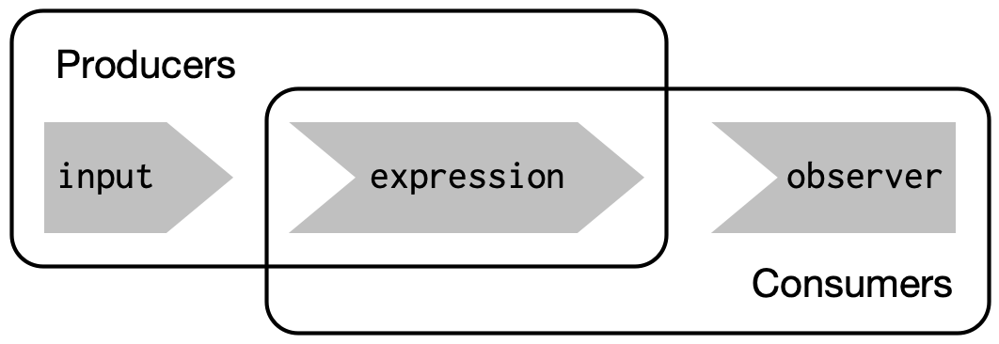

```{r setup, include=FALSE}
knitr::opts_chunk$set(echo = TRUE)
library(shiny)
library(tidyverse)
```

## Intro

The key idea of **reactive programming** is to specify a graph of dependencies so that when an input changes, all related outputs are automatically updated.

When the `server()` function is called, Shiny creates a new local environment that is independent of every other invocation of the function. This allows each session to have a unique state, as well as isolating the variables created inside the function. 

## Input

The `input` argument is list-like, but read-only. It reflects what is happening in the browser, which is considered the source of truth for the app. 

To read from an `input`, you must be in a reactive context created by a function like `render*()` or `reactive()`.

## Output

The `output` argument is also list-like. 

It's ID is quoted in the UI, but not in the server. 

The `render` function does two things:

1. Sets up special reactive context to track what input the output uses. i.e. **you don’t need to tell an output when to update, because Shiny automatically figures it out for you.**

2. Converts R to HTML

## Declarative programming

Think of your app as providing Shiny with recipes, not giving it commands.

Because code is only run when needed, you need to look at the **reactive graph** to understand the order of execution. 

Below is a reactive graph for the sample server section:

```{r react1, eval=FALSE}
server <- function(input, output, session) {
  text <- reactive(paste0("Hello ", input$name, "!"))
  output$greeting <- renderText(text())
}
```



### Practice

**1. Draw the reactive graph for the following server functions:**

```{r react2, eval=FALSE}
server1 <- function(input, output, session) {
  c <- reactive(input$a + input$b)
  e <- reactive(c() + input$d)
  output$f <- renderText(e())
}
```

a + b -> c + d -> e -> f

```{r react3, eval=FALSE}
server2 <- function(input, output, session) {
  x <- reactive(input$x1 + input$x2 + input$x3)
  y <- reactive(input$y1 + input$y2)
  output$z <- renderText(x() / y())
}
```

x -> y -> z

```{r react4, eval=FALSE}
server3 <- function(input, output, session) {
  d <- reactive(c() ^ input$d)
  a <- reactive(input$a * 10)
  c <- reactive(b() / input$c) 
  b <- reactive(a() + input$b)
}
```

a -> b -> c -> d 

**2. Can the reactive graph contain a cycle? Why/why not?**

A reactive graph essentially is a cycle that is updated every time the input is changed. For each session, each combination of inputs can only create one final product in the browser. 

## Reactive Expressions



When assembling an app, it is a best practice to ensure that the functions outside of the app focus on the computation so that the code inside of the app can focus on responding to user actions.

#TODO: finish problems once they've been added
